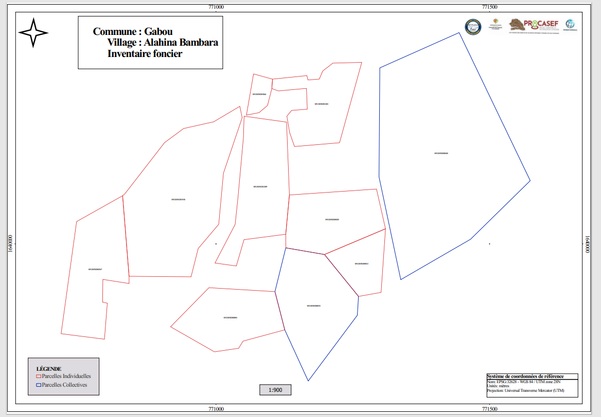

# 🗺️ Sécurisation Foncière et Recensement (PROCASEF)

### 📌 Présentation du Projet
Dans le cadre du projet PROCASEF j'ai exercé en tant que Géomaticienne  Ma mission principale consistait au traitement, à la vérification et à la validation des données foncières afin de garantir la fiabilité et la sécurité du processus de sécurisation.

### 🛠️ Expertise en Gestion & Production SIG
* **Supervision et Validation des Enquêtes** : Vérification et approbation des enquêtes socio-foncières en temps réel via **KoboCollect/QField** pour garantir la qualité et l'intégrité des données terrain.
* **Architecture de Données** : Structuration et intégration des données parcellaires dans une base de données spatiale **PostgreSQL / PostGIS**.
* **Automatisation (Atlas QGIS & Python)** : Génération automatisée de cartes parcellaires et d'extraits de plans via l'outil Atlas pour l'affichage public et la validation communautaire.
* **Analyses Socio-foncières** : Croisement des données géographiques avec les indicateurs des enquêtes ménages.

### 🚀 Impact du Projet
* Digitalisation et modernisation du cadastre rural dans les zones d'intervention.
* Facilitation de la communication avec les populations grâce à des supports cartographiques clairs et transparents.

### 📊 Livrables et Affichage sur le terrain
**Exemple de carte parcellaire générée par Atlas pour affichage public :**

**Réunion de sensibilisation et affichage des plans aux populations :**

